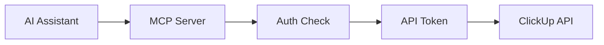
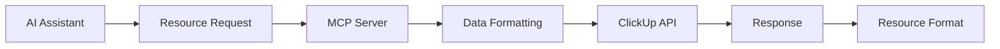
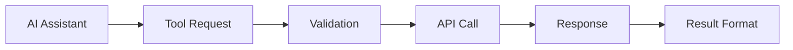

# ClickUp MCP Server Product Context

## Purpose
The ClickUp MCP Server bridges the gap between AI assistants and ClickUp's project management platform, enabling AI systems to interact with ClickUp without needing to understand the complexities of its API.

## Problems Solved

### For AI Assistants
1. API Complexity Abstraction
   - Simplifies ClickUp API interaction through standardized MCP tools
   - Handles authentication and request formatting
   - Manages error handling and recovery

2. Resource Access
   - Provides structured access to ClickUp data
   - Enables consistent data retrieval patterns
   - Maintains clear relationships between resources

3. Operation Standardization
   - Converts ClickUp-specific operations into standard MCP tools
   - Ensures consistent interaction patterns
   - Provides clear feedback and error messages

### For Developers
1. Integration Simplification
   - Reduces implementation complexity
   - Provides clear documentation
   - Offers standardized testing approaches

2. Security Management
   - Handles API token security
   - Manages authentication flows
   - Protects sensitive data

## How It Works

### Core Components
1. API Integration Layer
   - Connects to ClickUp API
   - Handles authentication
   - Manages rate limiting
   - Processes API responses

2. MCP Tools Layer
   - Exposes ClickUp operations as MCP tools
   - Validates inputs
   - Formats responses
   - Handles errors

3. Resource Layer
   - Provides URI-based access to ClickUp data
   - Maintains resource relationships
   - Enables efficient data retrieval

### Key Workflows

1. Authentication

2. Data Access

3. Operation Execution

## User Experience Goals

### For AI Assistants
1. Clear Understanding
   - Well-documented tools and resources
   - Consistent interaction patterns
   - Clear error messages

2. Efficient Operation
   - Optimized data access
   - Streamlined workflows
   - Reliable performance

3. Error Recovery
   - Clear error identification
   - Recovery suggestions
   - Graceful failure handling

### For Developers
1. Easy Integration
   - Clear documentation
   - Standard MCP patterns
   - Comprehensive examples

2. Reliable Operation
   - Stable API integration
   - Consistent performance
   - Good error handling

3. Maintainable Code
   - Clear architecture
   - Strong typing
   - Good test coverage

## Success Metrics
1. Technical
   - All tools properly documented
   - All resources correctly exposed
   - Clean test results

2. User Experience
   - Clear AI understanding
   - Efficient operations
   - Good error handling

3. Integration
   - Reliable ClickUp connection
   - Secure operation
   - Consistent performance
