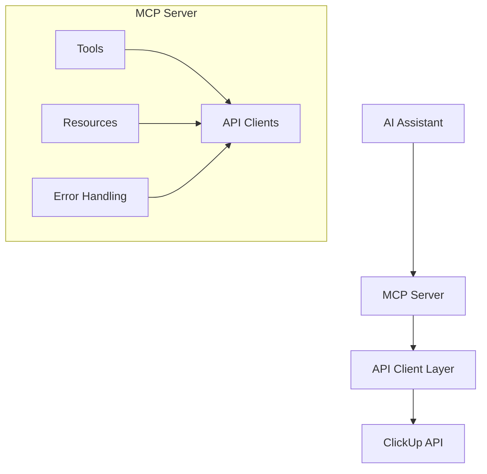
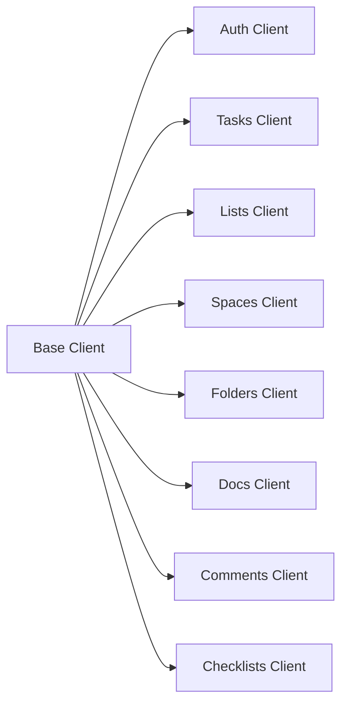
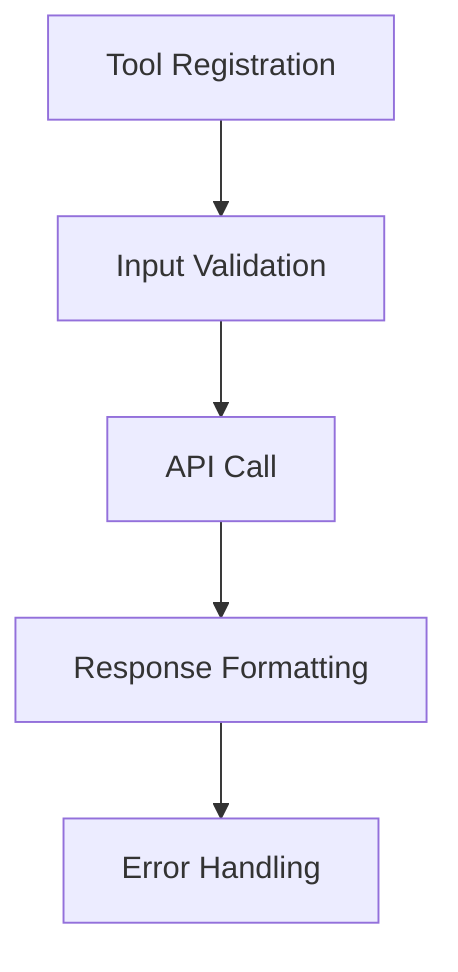
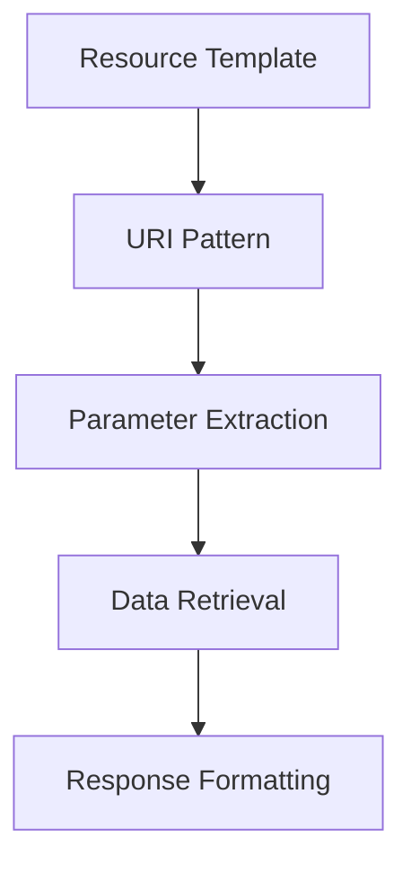
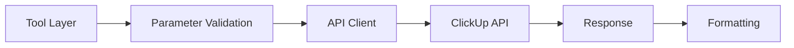
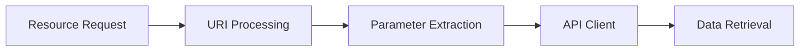
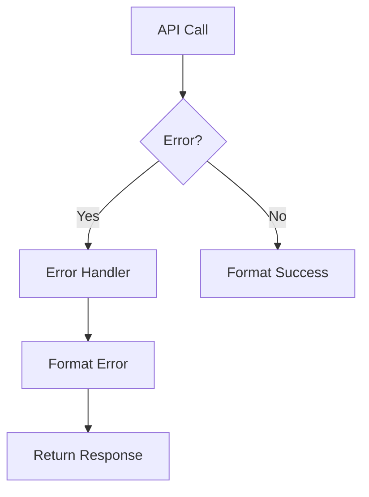

# ClickUp MCP Server System Patterns

## Architecture Overview



## Core Patterns

### 1. API Client Layer


Pattern:
- Each entity has dedicated client
- Clients inherit from base client
- Consistent error handling
- Standard response formatting

### 2. Tool Implementation


Pattern:
- Clear tool naming
- Strong parameter typing
- Comprehensive descriptions
- Consistent error patterns

### 3. Resource Structure


Pattern:
- URI-based access
- Clear parameter patterns
- Consistent data format
- Resource relationships

## Design Decisions

### 1. Authentication
- API Token based
- Optional OAuth support
- Token security measures
- Rate limiting handling

### 2. Error Handling
```typescript
try {
  // API call
} catch (error: any) {
  console.error('[Error] API call failed:', error);
  return {
    content: [{ type: 'text', text: `Error: ${error.message}` }],
    isError: true
  };
}
```

Pattern:
- Consistent error format
- Detailed error messages
- Error type identification
- Recovery suggestions

### 3. Response Formatting
```typescript
return {
  content: [{
    type: 'text',
    text: JSON.stringify(result, null, 2)
  }]
};
```

Pattern:
- Consistent structure
- Pretty formatting
- Type identification
- Complete data

## Component Relationships

### 1. Tool to Client


### 2. Resource to Client


### 3. Error Flow


## Implementation Guidelines

### 1. Tool Creation
```typescript
server.tool(
  'tool_name',
  { description: 'Tool purpose and usage' },
  {
    param: z.string().describe('Parameter description')
  },
  async (params) => {
    // Implementation
  }
);
```

### 2. Resource Definition
```typescript
server.resource(
  'resource_name',
  new ResourceTemplate('scheme://{param}'),
  async (uri, params) => {
    // Implementation
  }
);
```

### 3. Error Handling
```typescript
try {
  const result = await apiCall();
  return formatSuccess(result);
} catch (error) {
  return formatError(error);
}
```

## Testing Patterns

### 1. Tool Testing
- Verify registration
- Check descriptions
- Validate parameters
- Test error cases

### 2. Resource Testing
- Verify URI patterns
- Check data access
- Validate formatting
- Test relationships

### 3. Integration Testing
- End-to-end flows
- Error scenarios
- Performance checks
- Security validation

## Best Practices

### 1. Code Organization
- Modular structure
- Clear separation
- Consistent patterns
- Strong typing

### 2. Documentation
- Clear descriptions
- Usage examples
- Error guidance
- Relationship documentation

### 3. Error Management
- Consistent handling
- Clear messages
- Recovery paths
- Logging standards
