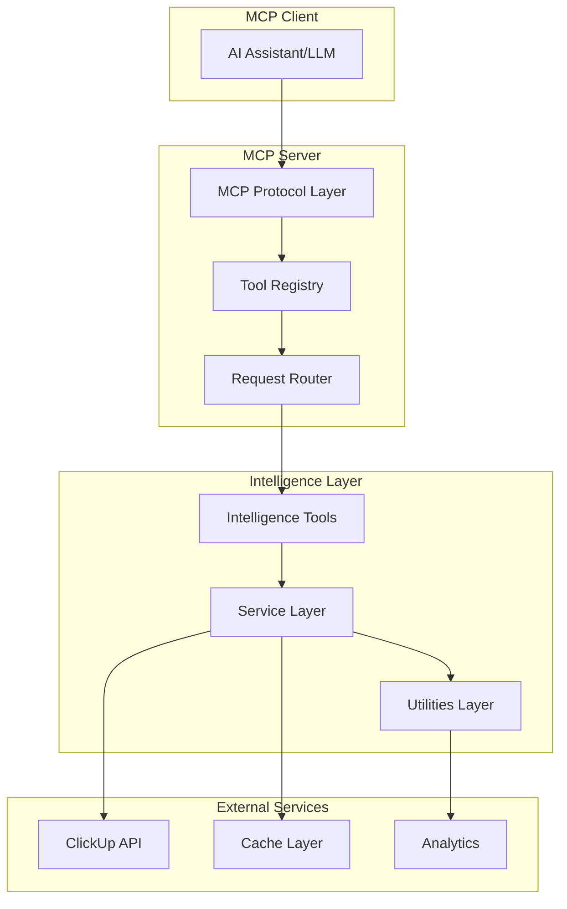
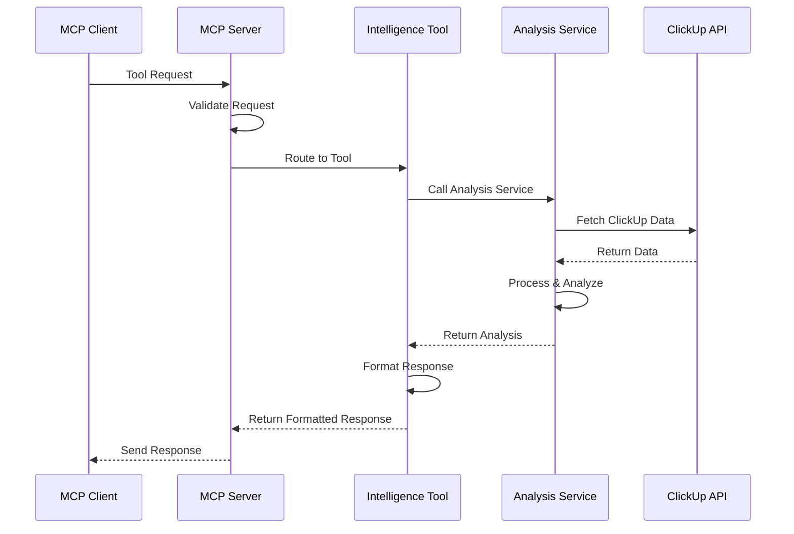

# System Architecture

This document provides a comprehensive overview of the ClickUp Intelligence MCP Server architecture, including component relationships, data flow, and design patterns.

## 🏗️ High-Level Architecture



## 📦 Component Architecture

### 1. MCP Protocol Layer
**Location**: `src/index.ts`

The MCP layer handles protocol communication and tool registration:

```typescript
class ClickUpIntelligenceServer {
  private server: Server;
  
  constructor() {
    this.server = new Server({
      name: 'clickup-intelligence-mcp-server',
      version: '4.1.0'
    }, {
      capabilities: { tools: {} }
    });
    
    this.setupToolHandlers();
  }
}
```

**Responsibilities**:
- Protocol compliance and message handling
- Tool registration and discovery
- Request routing and response formatting
- Error handling and validation

### 2. Intelligence Tools Layer
**Location**: `src/tools/`

Intelligence tools provide AI-powered functionality:

```typescript
// Tool structure
interface IntelligenceTool {
  name: string;
  description: string;
  inputSchema: JSONSchema;
  handler: (params: any) => Promise<ToolResponse>;
}
```

**Tool Categories**:
- **Project Health Analysis** (`project-health-analyzer.ts`)
- **Sprint Planning** (`smart-sprint-planner.ts`)
- **Task Management** (`task-decomposition-engine.ts`)
- **Resource Optimization** (`resource-optimizer.ts`)
- **Workflow Intelligence** (`workflow-intelligence.ts`)
- **Real-Time Processing** (`real-time-tools.ts`)

### 3. Services Layer
**Location**: `src/services/`

Services contain business logic and external integrations:

```typescript
// Service interface pattern
interface IntelligenceService {
  analyze(input: InputData): Promise<AnalysisResult>;
  validate(input: InputData): boolean;
  format(result: AnalysisResult): FormattedOutput;
}
```

**Core Services**:
- **Health Metrics Service** - Project health calculations
- **Velocity Analysis Service** - Sprint velocity predictions
- **Capacity Modeling Service** - Team capacity analysis
- **Task Analysis Service** - Task complexity assessment
- **Resource Optimization Service** - Workload balancing
- **Workflow Intelligence Service** - Pattern analysis

### 4. Utilities Layer
**Location**: `src/utils/`

Utilities provide shared functionality:

```typescript
// Formatter interface
interface ReportFormatter {
  generateReport(data: AnalysisData): string;
  formatMarkdown(content: string): string;
  generateDashboard(metrics: Metrics): string;
}
```

**Utility Categories**:
- **Report Formatters** - Markdown and dashboard generation
- **Validation Helpers** - Input validation and sanitization
- **Error Handlers** - Consistent error management
- **Cache Managers** - Performance optimization

## 🔄 Data Flow Architecture

### Request Processing Flow



### Data Processing Pipeline

1. **Input Validation**
   ```typescript
   const validatedInput = validateToolInput(rawInput, schema);
   ```

2. **Data Fetching**
   ```typescript
   const clickupData = await fetchClickUpData(validatedInput);
   ```

3. **Analysis Processing**
   ```typescript
   const analysisResult = await performAnalysis(clickupData);
   ```

4. **Response Formatting**
   ```typescript
   const formattedResponse = formatAnalysisResult(analysisResult);
   ```

## 🧠 Intelligence Architecture

### Analysis Engine Design

```typescript
abstract class AnalysisEngine<TInput, TOutput> {
  abstract analyze(input: TInput): Promise<TOutput>;
  
  protected validateInput(input: TInput): boolean {
    // Common validation logic
  }
  
  protected formatOutput(result: TOutput): ToolResponse {
    // Common formatting logic
  }
}
```

### Service Composition Pattern

```typescript
class CompositeAnalysisService {
  constructor(
    private healthService: HealthMetricsService,
    private velocityService: VelocityAnalysisService,
    private capacityService: CapacityModelingService
  ) {}
  
  async performComprehensiveAnalysis(input: AnalysisInput): Promise<ComprehensiveResult> {
    const [health, velocity, capacity] = await Promise.all([
      this.healthService.analyze(input),
      this.velocityService.analyze(input),
      this.capacityService.analyze(input)
    ]);
    
    return this.combineResults(health, velocity, capacity);
  }
}
```

## 🚀 Performance Architecture

### Caching Strategy

```typescript
interface CacheStrategy {
  key: string;
  ttl: number; // Time to live in seconds
  invalidationRules: InvalidationRule[];
}

const CACHE_STRATEGIES = {
  PROJECT_HEALTH: { key: 'health:{workspaceId}', ttl: 3600 }, // 1 hour
  TEAM_VELOCITY: { key: 'velocity:{teamId}', ttl: 7200 },     // 2 hours
  CAPACITY_MODEL: { key: 'capacity:{teamId}', ttl: 1800 }     // 30 minutes
};
```

### Memory Management

```typescript
class ResourceManager {
  private activeAnalyses = new Map<string, AnalysisContext>();
  
  async executeAnalysis<T>(id: string, analysis: () => Promise<T>): Promise<T> {
    try {
      this.activeAnalyses.set(id, { startTime: Date.now() });
      return await analysis();
    } finally {
      this.activeAnalyses.delete(id);
    }
  }
}
```

## 🔒 Security Architecture

### Input Validation

```typescript
class SecurityValidator {
  validateWorkspaceAccess(workspaceId: string, apiToken: string): boolean {
    // Validate workspace access
  }
  
  sanitizeInput(input: any): any {
    // Sanitize user input
  }
  
  validateRateLimit(clientId: string, endpoint: string): boolean {
    // Check rate limits
  }
}
```

### Error Handling

```typescript
class ErrorHandler {
  handleToolError(error: Error, context: ToolContext): ToolResponse {
    const sanitizedError = this.sanitizeError(error);
    return {
      content: [{ type: 'text', text: `❌ **Error**: ${sanitizedError.message}` }],
      isError: true
    };
  }
}
```

## 📊 Monitoring Architecture

### Metrics Collection

```typescript
interface PerformanceMetrics {
  toolName: string;
  executionTime: number;
  memoryUsage: number;
  cacheHitRate: number;
  errorRate: number;
}

class MetricsCollector {
  recordToolExecution(metrics: PerformanceMetrics): void {
    // Record metrics for monitoring
  }
}
```

### Health Checks

```typescript
class HealthChecker {
  async checkSystemHealth(): Promise<HealthStatus> {
    return {
      status: 'healthy',
      services: {
        clickupApi: await this.checkClickUpAPI(),
        cache: await this.checkCache(),
        memory: this.checkMemoryUsage()
      }
    };
  }
}
```

## 🔧 Extension Architecture

### Plugin System

```typescript
interface IntelligencePlugin {
  name: string;
  version: string;
  tools: ToolDefinition[];
  services: ServiceDefinition[];
  initialize(): Promise<void>;
}

class PluginManager {
  async loadPlugin(plugin: IntelligencePlugin): Promise<void> {
    await plugin.initialize();
    this.registerTools(plugin.tools);
    this.registerServices(plugin.services);
  }
}
```

### Tool Extension Pattern

```typescript
// Base tool class
abstract class IntelligenceTool<TInput, TOutput> {
  abstract name: string;
  abstract description: string;
  abstract inputSchema: JSONSchema;
  
  abstract execute(input: TInput): Promise<TOutput>;
  
  protected formatResponse(output: TOutput): ToolResponse {
    // Common response formatting
  }
}

// Extended tool implementation
class CustomAnalysisTool extends IntelligenceTool<CustomInput, CustomOutput> {
  name = 'custom_analysis_tool';
  description = 'Custom analysis functionality';
  inputSchema = { /* schema definition */ };
  
  async execute(input: CustomInput): Promise<CustomOutput> {
    // Custom implementation
  }
}
```

## 📈 Scalability Architecture

### Horizontal Scaling

```typescript
class LoadBalancer {
  private instances: ServerInstance[] = [];
  
  async routeRequest(request: ToolRequest): Promise<ToolResponse> {
    const instance = this.selectInstance(request);
    return await instance.handleRequest(request);
  }
  
  private selectInstance(request: ToolRequest): ServerInstance {
    // Load balancing logic
  }
}
```

### Resource Optimization

```typescript
class ResourceOptimizer {
  optimizeMemoryUsage(): void {
    // Memory optimization strategies
  }
  
  optimizeCacheUsage(): void {
    // Cache optimization strategies
  }
  
  optimizeNetworkRequests(): void {
    // Network optimization strategies
  }
}
```

## 🔄 Development Patterns

### Dependency Injection

```typescript
class ServiceContainer {
  private services = new Map<string, any>();
  
  register<T>(name: string, service: T): void {
    this.services.set(name, service);
  }
  
  resolve<T>(name: string): T {
    return this.services.get(name);
  }
}
```

### Factory Pattern

```typescript
class AnalysisServiceFactory {
  createService(type: AnalysisType): AnalysisService {
    switch (type) {
      case 'health': return new HealthAnalysisService();
      case 'velocity': return new VelocityAnalysisService();
      case 'capacity': return new CapacityAnalysisService();
      default: throw new Error(`Unknown analysis type: ${type}`);
    }
  }
}
```

## 📚 Architecture Decisions

### Design Principles
1. **Separation of Concerns** - Clear layer boundaries
2. **Single Responsibility** - Each component has one purpose
3. **Dependency Inversion** - Depend on abstractions, not concretions
4. **Open/Closed Principle** - Open for extension, closed for modification
5. **Interface Segregation** - Small, focused interfaces

### Technology Choices
- **TypeScript** - Type safety and developer experience
- **MCP SDK** - Protocol compliance and standardization
- **Jest** - Testing framework for reliability
- **ESLint** - Code quality and consistency
- **Zod** - Runtime type validation

### Performance Considerations
- **Async/Await** - Non-blocking I/O operations
- **Caching** - Reduce API calls and computation
- **Lazy Loading** - Load services on demand
- **Memory Management** - Proper resource cleanup
- **Rate Limiting** - Prevent API abuse

This architecture provides a solid foundation for building scalable, maintainable, and extensible intelligence tools while maintaining high performance and reliability.
